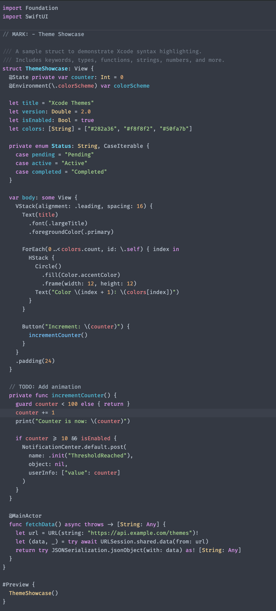
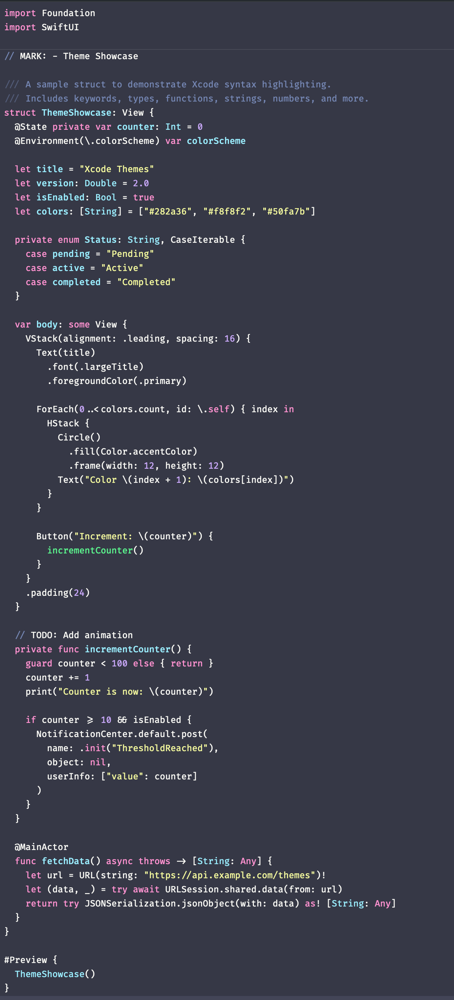
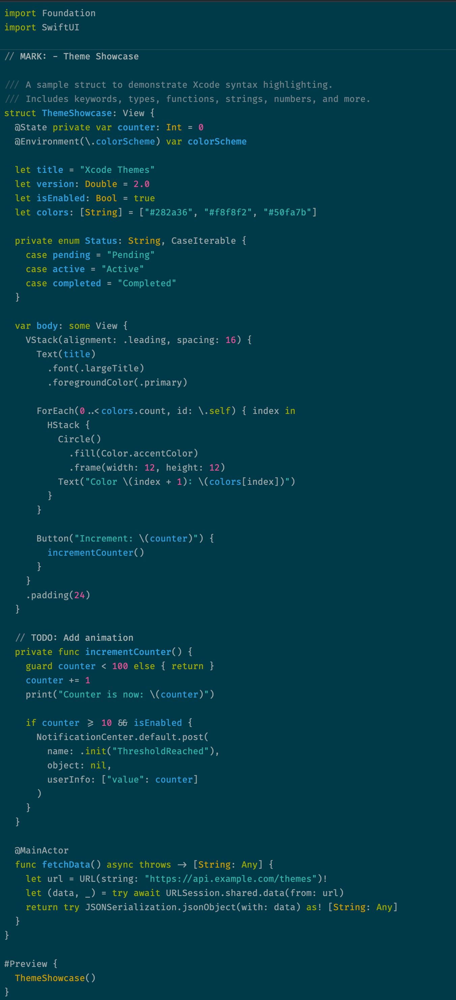
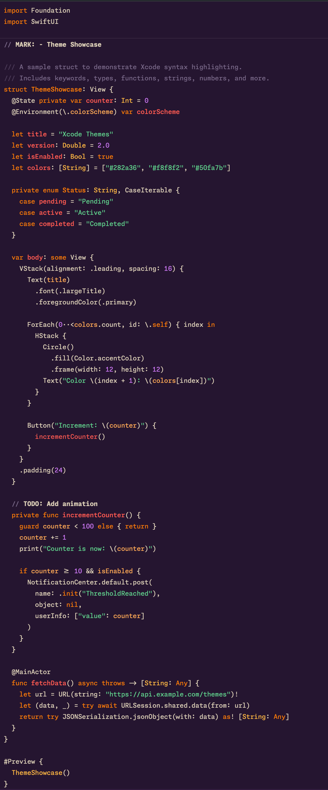
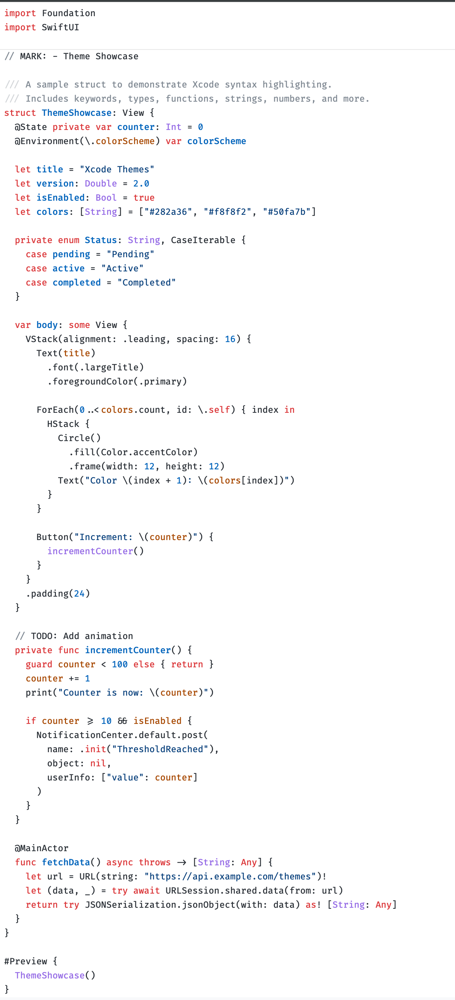
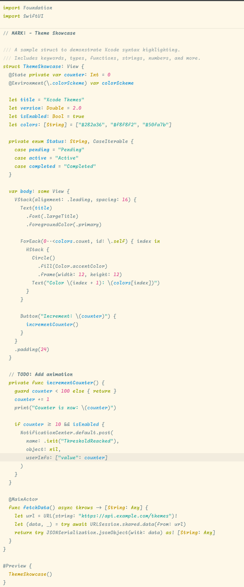

# Xcode Theme Installer

A collection of color themes for Xcode with multiple font options. Choose from **6 color schemes** and **6 fonts** for **36 possible combinations**.

Originally based on [xcode-one-dark](https://github.com/bojan/xcode-one-dark).

## Screenshots

### Dark Themes

| One Dark + Fira Code | Dracula + Fira Code |
| :---: | :---: |
|  |  |

| Solarized Dark + Fira Code | Halloween + Monaspace Neon |
| :---: | :---: |
|  |  |

### Light Themes

| GitHub Light + Fira Code | Solarized Light + Monaspace Radon |
| :---: | :---: |
|  |  |

## Color Schemes

| # | Scheme | Type | Based on |
| --- | -------- | ------ | ---------- |
| 1 | One Dark | Dark | [Atom One Dark](https://github.com/bojan/xcode-one-dark) |
| 2 | Dracula | Dark | [Dracula Theme](https://draculatheme.com/) |
| 3 | Solarized Dark | Dark | [Solarized](https://ethanschoonover.com/solarized/) by Ethan Schoonover |
| 4 | Solarized Light | Light | [Solarized](https://ethanschoonover.com/solarized/) by Ethan Schoonover |
| 5 | GitHub Light | Light | [GitHub Light Default](https://github.com/) |
| 6 | Halloween | Dark | Custom (orange, purple, green) |

## Fonts

| # | Font | Style |
|---|------|-------|
| 1 | [Fira Code](https://github.com/tonsky/FiraCode) | Monospaced with ligatures |
| 2 | [Monaspace Neon Frozen](https://monaspace.githubnext.com/) | Neo-grotesque sans-serif |
| 3 | [Monaspace Argon Frozen](https://monaspace.githubnext.com/) | Humanist sans-serif |
| 4 | [Monaspace Xenon Frozen](https://monaspace.githubnext.com/) | Slab serif |
| 5 | [Monaspace Radon Frozen](https://monaspace.githubnext.com/) | Handwriting |
| 6 | [Monaspace Krypton Frozen](https://monaspace.githubnext.com/) | Mechanical sans-serif |

## Installation

### Swift Package Manager (Recommended)

Clone the repo and run `swift run`. A two-step interactive menu lets you pick your color scheme(s) and font(s):

```bash
git clone https://github.com/SwiftyJourney/OneDarkTheme.git
cd OneDarkTheme
swift run
```

The installer will:
1. Ask you to choose one or more color schemes (or all 6)
2. Ask you to choose one or more fonts (or all 6)
3. Download and install the required fonts automatically
4. Generate and install the selected theme combinations to Xcode's themes directory

Select "All color schemes" + "All fonts" to install all 36 combinations at once.

(Optional) Remove the cloned project after installation:

```bash
cd ..
rm -rf OneDarkTheme
```

### Manual

Each color scheme has a base `.xccolortheme` file in the repository root (using Fira Code as the default font):

1. Download [Fira Code](https://github.com/tonsky/FiraCode) and add the fonts from the `ttf` folder to your Font Book
2. Create the themes directory and copy your desired theme file:

```bash
mkdir -p ~/Library/Developer/Xcode/UserData/FontAndColorThemes
cp "One Dark.xccolortheme" ~/Library/Developer/Xcode/UserData/FontAndColorThemes/
```

Available base theme files:
- `One Dark.xccolortheme`
- `Dracula.xccolortheme`
- `Solarized Dark.xccolortheme`
- `Solarized Light.xccolortheme`
- `GitHub Light.xccolortheme`
- `Halloween.xccolortheme`

For Monaspace font variants, use `swift run` instead — the installer generates all font combinations dynamically.

After installing, open Xcode (restart if it was already open), go to **Preferences > Themes**, and select your preferred theme.

## Attributions

- [Bojan Dimovski](https://github.com/bojan), for the original [xcode-one-dark](https://github.com/bojan/xcode-one-dark) theme.
- [John Sundell](https://github.com/JohnSundell), for the [Files](https://github.com/JohnSundell/Files) and [ShellOut](https://github.com/JohnSundell/ShellOut) libraries.
- [GitHub Next](https://githubnext.com/), for the [Monaspace](https://monaspace.githubnext.com/) font superfamily.
- [José Davalos](https://github.com/jdavros), for introducing me to the Monaspace fonts.
- [Dracula Theme](https://draculatheme.com/), for the Dracula color specification.
- [Ethan Schoonover](https://ethanschoonover.com/solarized/), for the Solarized color palette.
- [GitHub](https://github.com/), for the GitHub Light color scheme reference.
